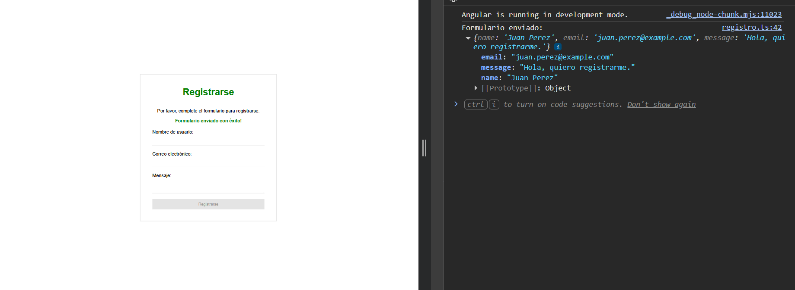
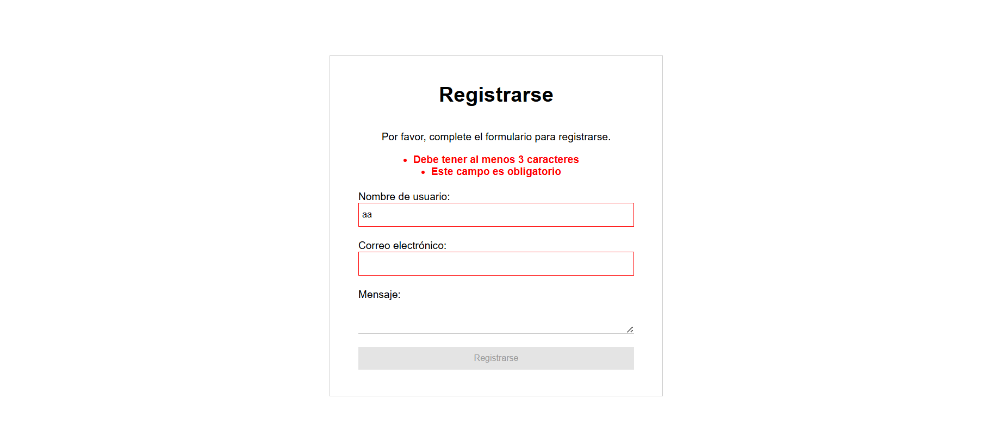

# Formulario Interactivo - Angular básico

Proyecto realizado para el Módulo 1 - Unidad 2, centrado en el uso de directivas y formularios reactivos en Angular.

La aplicación incluye un componente `registro` con un formulario de registro validado, mensajes de error dinámicos, estilos condicionales y confirmación visual al enviar los datos.

## Objetivo

Aplicar formularios reactivos con `FormBuilder`, validaciones básicas y directivas estándar para construir una experiencia de usuario simple e interactiva.

## Instalación

1. Clonar el repositorio.
2. Instalar dependencias:

```bash
npm install
```

## Ejecución

Levantar el servidor de desarrollo con:

```bash
ng serve
```

Luego abrir la aplicación en:

```bash
http://localhost:4200/
```

## Ejemplo de uso

Completar el formulario con un nombre válido, un correo electrónico correcto y, si se desea, un mensaje. Al presionar **Enviar**, la consola muestra los datos ingresados y el formulario se reinicia.

Ejemplo de salida en consola:

```bash
Formulario enviado: { name: 'Juan Perez', email: 'juan.perez@example.com', message: 'Hola, quiero registrarme.' }
```



## Capturas de pantalla

- Formulario con errores de validación.


## Créditos

- Estudiante: Luciano Buceta
- Curso: Angular básico
- Unidad: Módulo 1 - Unidad 2

## Fuentes y bibliografía

- Documentación oficial de Angular: https://angular.dev/
- Reactive Forms en Angular: https://angular.dev/guide/forms/reactive-forms

